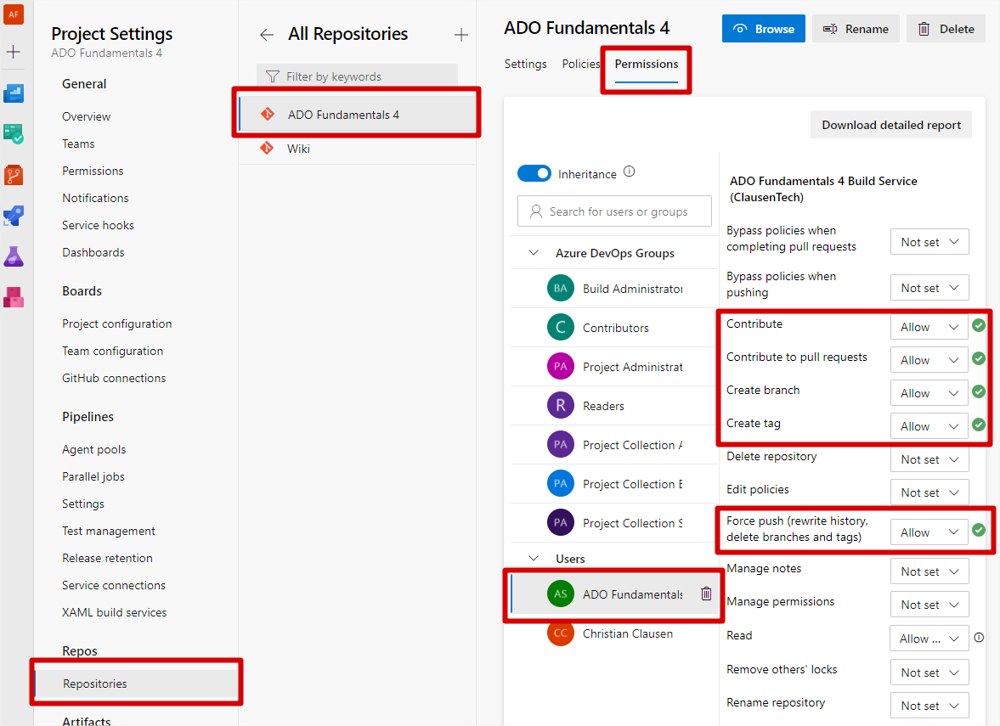

# Task: Automatic Compile

1. Create a pipeline to build the code with gradle.

    <details>
      <summary>Step by step</summary>

    1. Create a file called `build.yml` containing this minimal pipeline:

        ```yaml
        trigger:
          - '*'

        pool:
          vmImage: "ubuntu-latest"

        steps:
          - script: |
              echo “Hello, World!”
            displayName: "Print important message"
        ```

    2. Use this step to checkout the code:

        ```yaml
        - checkout: self
        ```

    3. Use this step to run gradle:

        ```yaml
        - task: Gradle@2
          inputs:
            workingDirectory: ""
            gradleWrapperFile: "gradlew"
            gradleOptions: "-Xmx3072m"
            javaHomeOption: "JDKVersion"
            jdkVersionOption: "1.8"
            jdkArchitectureOption: "x64"
            publishJUnitResults: true
            testResultsFiles: "**/TEST-*.xml"
            tasks: "build"
        ```

    4. Go to Pipelines.
    5. Click "New pipeline".
    6. Click "Azure Repos Git (YAML)".
    7. Select the correct repo.
    8. Click "Existing Azure Pipeline YAML file".
    9. Select the YAML file, then "Continue".
    10. Click the down-arrow next to "Run" and hit "Save".
    11. Click the three dots in the upper right, and hit "Rename/move".
    12. Call it "build".
    </details>

2. It should trigger on pushes to all branches, except main.

    <details>
      <summary>Hint</summary>

    ```yaml
    trigger:
      branches:
        exclude:
          - main
    ```

    </details>

3. Also set it to timeout after 5 minutes.

    <details>
      <summary>Hint</summary>

    ```yaml
    jobs:
      - job: Test
        timeoutInMinutes: 5
    ```

    Important: `steps` needs to be indented to the same level as `timeoutInMinutes`.
    </details>

# Task: Automatic integration

1. First, we need to setup the permissions in the project settings:
   

2. Setup a new pipeline to automatically merge a branch into main.
   This one will ensure that we have _continuous integration_ so lets name
   the file `ci.yml` and rename the pipeline accordingly when you have set it up.

   Integrating a branch to main could be done with the following Git commands:

    ```sh
    git rebase origin/main
    git push origin HEAD:main
    git push -d origin $(Build.SourceBranch)
    ```

    <details>
      <summary>Hint</summary>

    ```yaml
    - checkout: self
      persistCredentials: true
    ```

    </details>

3. It should trigger automatically after a run of the build pipeline
   but only on branches that match the `ready/*` pattern.

    <details>
      <summary>Hint</summary>

    ```yaml
    trigger: none
    resources:
      pipelines:
        - pipeline: name
          source: build
          trigger:
            branches:
              - ready/*
    ```

    </details>

4. Remember to update the "How to contribute" section in the `README.md`.
5. Test it by pushing a commit to a `ready/` branch.

    <details>
      <summary>Hint</summary>

    ```sh
    git push origin HEAD:ready/[BRANCH]
    ```

    </details>

# Task: Safer integration

Add fast tests to the CI build.

<details>
  <summary>Hint</summary>

In the `build.yml` change

```yaml
tasks: "build"
```

into

```yaml
tasks: "test"
```

</details>
